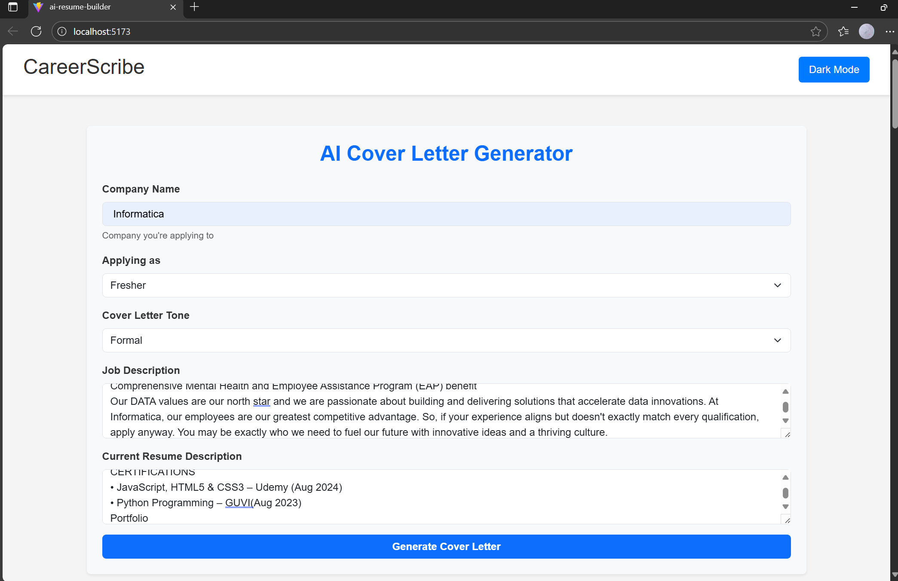
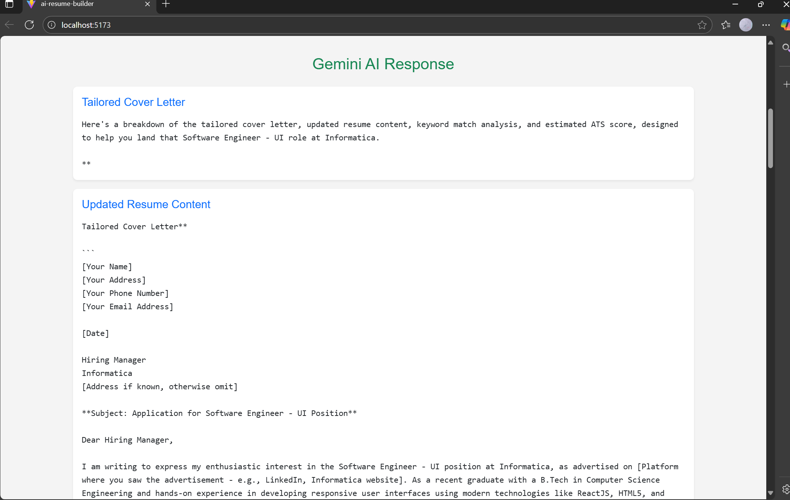

# CoverCraft – AI Cover Letter & Resume Generator





## Project Description
**CoverCraft** is an AI-powered web application that helps job seekers generate professional cover letters and optimize their resumes in seconds. This tool uses AI to analyze job descriptions, highlight key skills, and create tailored content for job applications.

The platform is **interactive, user-friendly, and fully responsive**, making it perfect for both freshers and experienced professionals. Users can customize the tone of the cover letter, preview AI-generated content in real-time, and download resumes and letters in multiple formats.

---

## Features
- **AI-Powered Content Generation:** Generate personalized cover letters and improved resume content.  
- **Real-Time Preview:** See the generated content instantly.  
- **Dark/Light Mode:** Toggle between themes for better readability.  
- **Tone Selection:** Choose cover letter tone: Formal, Informal, Casual, Persuasive, Confident.  
- **ATS Keyword Analysis:** Highlight missing keywords to improve resume ranking in applicant tracking systems.  
- **Template Selection:** Multiple cover letter and resume templates.  
- **Download Options:** Export generated content as PDF or TXT.  
- **Social Media Links:** Easily connect and share via GitHub, LinkedIn, or Twitter.  
- **Responsive Design:** Works perfectly on mobile, tablet, and desktop.  

---

## Tech Stack
- **Frontend:** React.js, HTML, CSS  
- **AI Integration:** Google Generative Language API  
- **State Management:** React Hooks (`useState`, `useEffect`)  
- **Extras:** jsPDF for downloads, localStorage for saving drafts  

---

## Installation
1. Clone the repository:  
```bash
git clone https://github.com/your-username/covercraft.git
